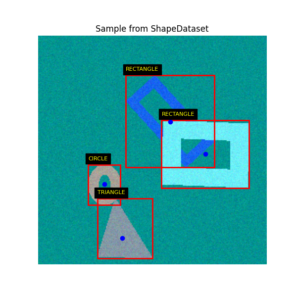
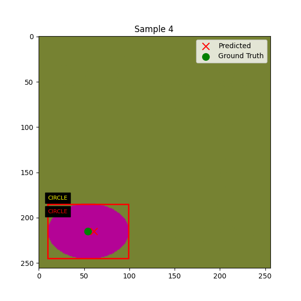

# DeepVision Playground

DeepVision Playground is an open-source, hands-on platform designed to demystify and explore the core neural network
concepts behind computer vision models. It provides a modular, from-scratch implementation framework that lets you
generate synthetic data, experiment with custom architectures, and implement different tasks such as object detection,
localization, classification and semantic segmentation

The goal of DeepVision Playground is to be an educational sandbox that encourages a deep,
practical understanding of how deep learning operates on visual data.

## Current Status
Synthetic Shapes dataset which produces random rectangles, ellipses, and triangles on to random backgrounds
Example Image:

Simple model to localize center of single shape with option to also classify shape type
This can be used by running simple_center_net.py it will output 5 samples with label and prediction

Where if the shape is also being classified the prediction is the text under the yellow label in red

## Todo's
Figure out how to document examples
Work on network to detect multiple objects
Add more advanced classes i.e. red square, red square outline, ?
Lot's more